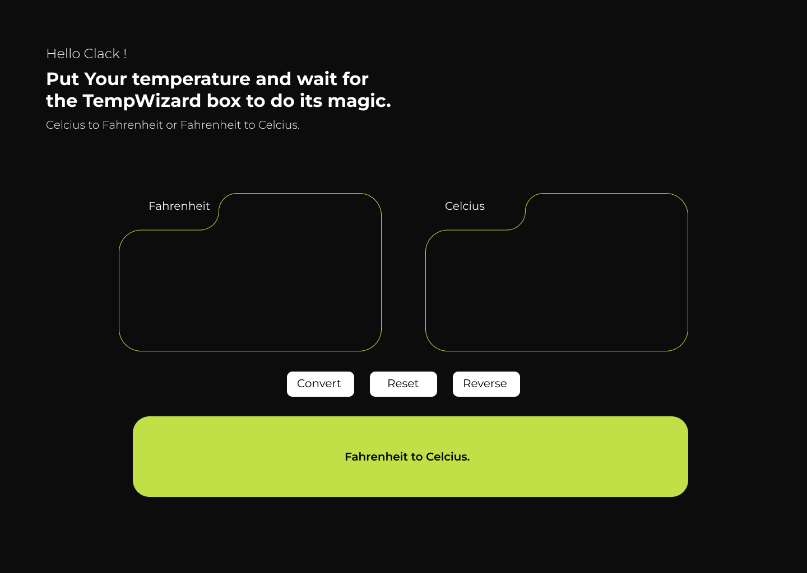
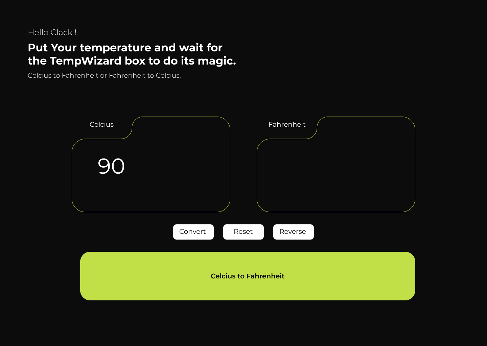
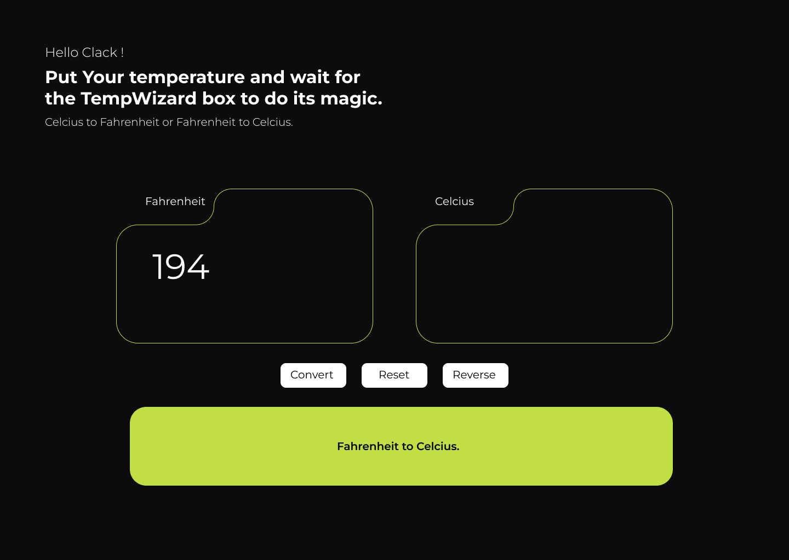
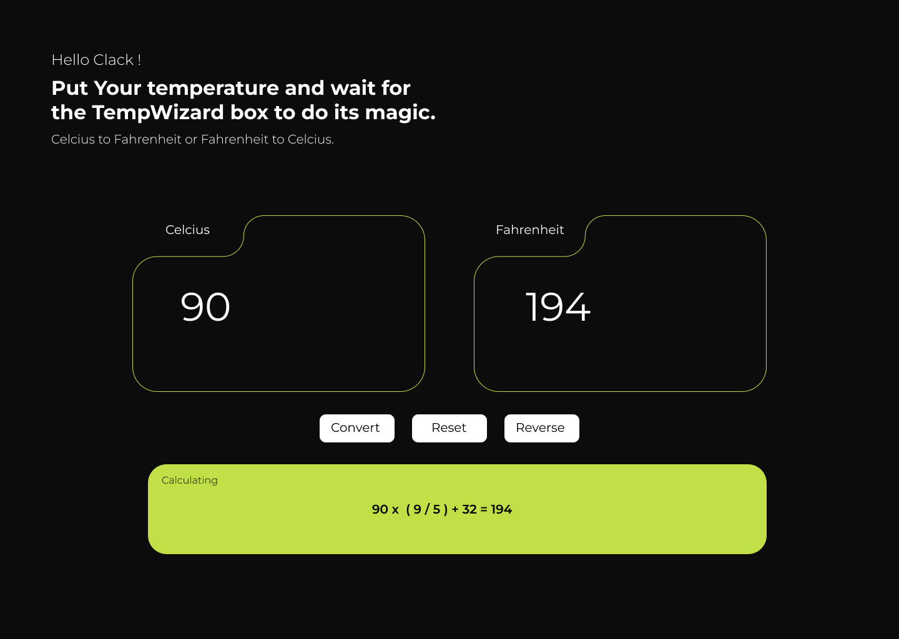
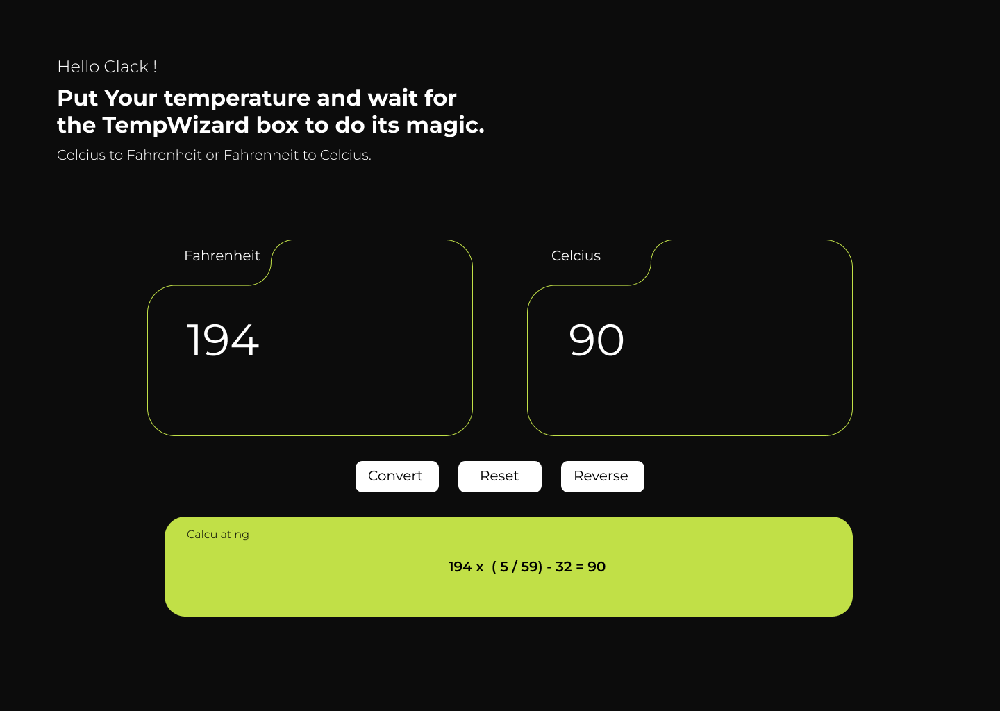

# Documentation and Demo TempWizard

## Ideasi

### Reset

### Input Celcius

### Input Fahrenheit

### Calculating Celcius to Fahrenheit

### Calculating Fahrenheit to Celcius

## Prototype

[TempWizard ideasi mockup](https://www.figma.com/proto/dQkNIMOn6eWRKzm7OIyVRo/Suhu-RevoU?node-id=1-2&t=XRFnv3gPQTnsJ9Ok-1&scaling=min-zoom&content-scaling=fixed&page-id=0%3A1&starting-point-node-id=1%3A2)

  

  